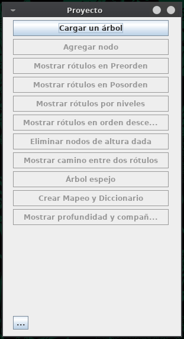

# TDA
### Tipo de Datos Abstractos en Java

Las estructuras de datos corresponden al libro "Data Structures anda Algorithms in Java" de Michael T. Goodrich y Roberto Tamassia

## Mini Aplicacion

La aplicación (también implementada en Java) es una pequeña muestra donde se utilizan los TDA para manipular un árbol

